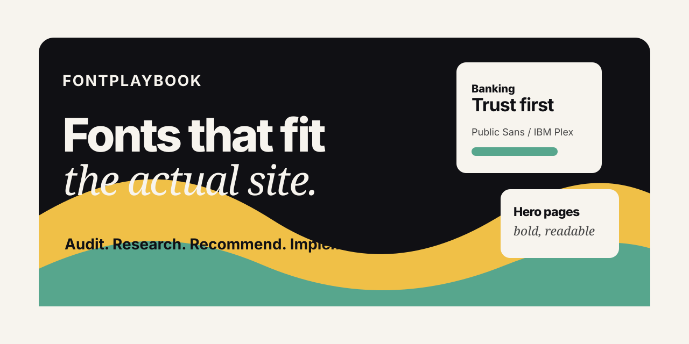

<p align="center">
  
</p>

# FontPlaybook

FontPlaybook is a typography skill for AI-built websites. It helps Claude, Codex, and other coding agents stop guessing at fonts and start making type decisions like a designer: by reading the site, understanding the domain, researching comparable usage when useful, recommending options, implementing the CSS, and verifying the result in the browser.

It is built for the vibe coding community: people moving fast with AI who still want the final webpage to feel intentional, credible, and polished.

## Why This Exists

AI can build a page quickly, but typography is where a lot of generated websites still fall apart. The font is generic, the hierarchy is weak, the weights are overloaded, the hero feels mismatched, or the imported font never actually loads.

FontPlaybook gives the agent a practical workflow:

- Audit the current template before changing fonts.
- Decide what the site needs to communicate.
- Pick different typography for a bank, SaaS dashboard, hero page, restaurant, portfolio, editorial site, or playful product.
- Research real-world font usage when browser/internet access is available.
- Recommend a `Best fit`, `Safe fit`, and `Bold fit`.
- Implement with CSS tokens, fallbacks, correct weights, line-height, and letter-spacing.
- Verify that the intended font actually renders.

## What It Helps With

- Replacing generic/default fonts in a webpage.
- Choosing fonts that match the business domain.
- Making hero typography stronger without ruining body readability.
- Debugging broken Google Fonts or self-hosted font loading.
- Creating type scales and CSS variables.
- Avoiding over-designed font pairings.
- Making dashboards, forms, buttons, tables, captions, and nav items inherit a coherent typography system.

## How It Thinks

FontPlaybook does not say, "Use Inter" and call it done.

It asks the agent to produce a decision report like this:

```markdown
Typography direction:
- Site type:
- Current issue:
- Recommended direction:

Options:
1. Best fit:
2. Safe fit:
3. Bold fit:

Implementation:
- Load:
- CSS tokens:
- Body:
- Headings:
- Verification:
```

That structure keeps the AI from making a random taste call. It has to connect the font choice to the page, the audience, the industry, the implementation, and the verification step.

## Example Prompts

```text
Use FontPlaybook to audit this template. The fonts feel generic and the hero does not match the product. Recommend a best-fit, safe-fit, and bold-fit direction, then update the CSS.
```

```text
Use FontPlaybook on this banking dashboard. I need it to feel trustworthy and premium, but not boring. Check the existing font loading, compare real finance/SaaS typography patterns if you can, and implement the best direction.
```

```text
Use FontPlaybook to figure out why this template is not showing the font I imported. Fix the loading, fallback stack, weights, and CSS tokens.
```

More prompts live in [examples/demo-prompts.md](examples/demo-prompts.md).

## Site-Type Strategy

FontPlaybook includes domain-specific guidance so font choices fit the actual site:

| Site type | Typography direction |
| --- | --- |
| Banking, finance, healthcare, legal | Trustworthy, neutral, readable, clear numerals |
| SaaS and dashboards | Scannable, calm, efficient, strong UI sans |
| Hero landing pages | Strong display treatment with readable body/UI |
| Editorial and blogs | Comfortable long-form reading, measured line length |
| Luxury and premium commerce | Refined display moments with usable commerce UI |
| Restaurants and hospitality | Atmospheric headings with practical readable details |
| Portfolios and agencies | More expressive type that still supports the work |
| Playful products and games | Energetic display type with readable controls |

See [references/site-type-font-strategy.md](references/site-type-font-strategy.md) for the full playbook.

## Repo Structure

```text
FontPlaybook/
|-- SKILL.md
|-- README.md
|-- assets/
|   `-- fontplaybook-banner.svg
|-- examples/
|   |-- demo-prompts.md
|   `-- sample-report.md
`-- references/
    |-- font-playbook.md
    `-- site-type-font-strategy.md
```

## Install

Yes, FontPlaybook is easy to install, but use the right method for the Claude surface you are using.

### Claude.ai

Claude.ai custom skills are uploaded as a ZIP file. The ZIP should contain a folder named `font-playbook`, and that folder should contain `SKILL.md` plus the supporting folders.

Correct ZIP shape:

```text
font-playbook.zip
└── font-playbook/
    ├── SKILL.md
    ├── references/
    ├── examples/
    └── assets/
```

Steps:

1. Download or clone this repo.
2. Put the repo contents inside a folder named `font-playbook`.
3. ZIP that `font-playbook` folder.
4. In Claude.ai, go to `Customize > Skills`.
5. Click `+ Create skill`, choose `Upload a skill`, and upload the ZIP.
6. Enable the skill.

Claude's own docs note that custom skills are uploaded from `Customize > Skills` as a ZIP containing the skill folder, and that `SKILL.md` is the required entrypoint.

### Claude Code

For a personal Claude Code skill available across projects:

```bash
mkdir -p ~/.claude/skills
git clone https://github.com/MilkDeLeche/FontPlaybook.git ~/.claude/skills/font-playbook
```

Then invoke it directly:

```text
/font-playbook
```

Or ask naturally:

```text
Use FontPlaybook to audit this template's typography and recommend better fonts.
```

For a project-local install:

```bash
mkdir -p .claude/skills
git clone https://github.com/MilkDeLeche/FontPlaybook.git .claude/skills/font-playbook
```

Claude Code discovers skills from `~/.claude/skills/<skill-name>/SKILL.md` for personal use and `.claude/skills/<skill-name>/SKILL.md` for project use.

## Using The Skill

Use this repository as a skill package wherever your AI coding setup expects a `SKILL.md` file.

The important files are:

- [SKILL.md](SKILL.md): the core agent workflow.
- [references/font-playbook.md](references/font-playbook.md): font selection, pairing, CSS loading, type scales, and common fixes.
- [references/site-type-font-strategy.md](references/site-type-font-strategy.md): domain-specific typography guidance.

If your setup supports importing skills from a GitHub repository, point it at:

```text
https://github.com/MilkDeLeche/FontPlaybook.git
```

If your setup expects a local skill folder, clone the repo and place it in that skills directory.

## Companion Skill

FontPlaybook pairs well with [Design Discovery](https://github.com/MilkDeLeche/Design-Discovery).

Recommended setup:

- Use Design Discovery as the broad creative director: inspect the real element, offer directions, converge, build, verify.
- Use FontPlaybook as the typography specialist: audit fonts, research fit, pick type systems, implement loading and CSS.

Together they let an AI agent explore the design direction while still making typography decisions with discipline.

## Portfolio Note

This project is meant to be both useful and showcaseable: a small, focused example of turning design taste into reusable AI behavior. The goal is to help vibe coders ship sites that feel less generated and more designed.

## Roadmap

- Add before/after typography case studies.
- Add framework-specific examples for Tailwind, vanilla CSS, React, and Next.js.
- Add more font recommendations for niche domains.
- Add browser verification checklists for real rendered pages.
- Add a tiny demo site that shows the same layout with different FontPlaybook recommendations.

## Contributing

Good contributions make the skill more practical:

- Better domain-specific font guidance.
- Real-world examples of font usage.
- Improved implementation patterns.
- Stronger debugging notes for font loading issues.
- Case studies from real templates.

Keep the core skill concise. Put deeper guidance in `references/` so agents can load details only when needed.

## Author

Created by [MilkDeLeche](https://github.com/MilkDeLeche) for AI-assisted web design workflows.
